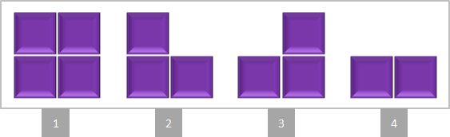
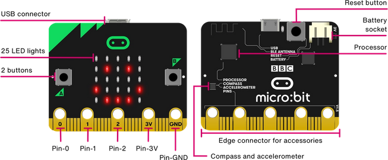

# Tetris per Micro:bit

Aquest projecte està basat en el projecte original ["BBC micro:bit – Tetris Game"](https://www.101computing.net/bbc-microbit-tetris-game/).

Hi ha quatre tipus de blocs que en diferents disposicions cauen des de la part superior de la matriu de LEDs. 

El jugador pot moure i girar els blocs per tal d'anar creant línies horitzontals. Quan es completa una línia aquesta desapareix i s'anota un punt. El joc s'acabarà quan els blocs s'apilen fins arribar a la fila superior de l'àrea de joc.

Per començar un nou joc cal premer el botó Reset que es troba a la part de darrera de la Micro:bit. El control del joc es realitzará de la següent manera:

- Botó A: mou el bloc actual cap a l'esquerra
- Botó B: mou el bloc actual cap a la dreta
- Botó A i B simultàniament: gira el bloc actual en sentit horari

El codi font del projecte es troba escrit en Python [Tetris_MicroBit.py](https://github.com/Scratch-BiP/Recursos/blob/master/Cicle%20superior/MicroBits/Tetris/Tetris_MicroBit.py).

## Instruccions per carrega el joc a la Micro:bit (Windows)

1. Connectar la Micro:bit amb el cable USB a l'ordinador.
2. Apareixerà una nova unitat de disc a l'explorador de fitxers de Windows.
3. Copiar el fitxer binari [Tetris_MicroBit.hex](https://github.com/Scratch-BiP/Recursos/raw/master/Cicle%20superior/MicroBits/Tetris/Tetris_MicroBit.hex) dins la unitat de disc del Micro:bit.
4. Quan s'hagi acabat la copia la Micro:bit, la unitat de disc desapareixerà i arrancarà automàticament el joc a la Micro:bit.

